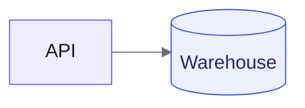
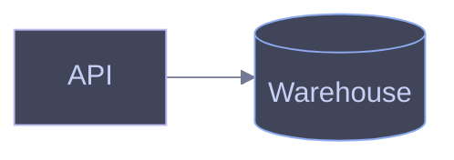

# Diagram Themes

Two named palettes with one shared semantic-class vocabulary, expressed per language. Pick the theme by audience, then style only through these classes — no ad-hoc hex in diagram source.

| Theme | Use for |
| --- | --- |
| `lightdash` | Anything work-facing — Lightdash PRs, docs, Notion, Linear, customer-facing material |
| `frappe` | Personal and Supermodel Labs projects, blog, dotfiles docs (Catppuccin Frappe, dark-first) |

## Semantic classes

Same class names in every diagram, both languages. Color reinforces meaning; the diagram must still read without it.

| Class | Meaning |
| --- | --- |
| `accent` | Primary subject or emphasized path |
| `data` | Stores — warehouses, databases, caches |
| `process` | Default compute/service nodes (usually the unstyled baseline) |
| `decision` | Branch points |
| `good` | Success paths, terminal-good states |
| `warn` | Failures, alerts, risky paths |
| `external` | Third-party or out-of-scope systems (dashed border) |

The Mermaid `%%{init}%%` blocks below are for mmdc-rendered exports and destinations that honor directives (Obsidian, Artifacts). GitHub ignores or mangles them — there, omit the init block and let the semantic classDefs carry the theme on top of GitHub's adaptive default.

## Lightdash

Brand violet `#7262FF` with the lightdash.com gray ramp; Inter for type. Field-type semantic colors (dimension blue, metric orange, calculation green) supply the non-violet accents, so diagrams read as part of the product family.

| Token | Value |
| --- | --- |
| violet (brand) | `#7262FF` |
| violet fill / deep | `#efedff` / `#2e2585` |
| text | `#1a1b25` |
| line / muted text | `#666d80` |
| surface / border | `#f8fafb` / `#c1c7d0` |
| dimension blue (text/bg) | `#3b5bdb` / `#EDF0FD` |
| metric orange (text/bg) | `#de7f0b` / `#FBE9E0` |
| calculation green (text/bg) | `#2b8a3e` / `#EBF5ED` |

### Mermaid



### D2

```d2
vars: {
  accent: "#7262FF"
}

classes: {
  accent: {style.fill: "#efedff"; style.stroke: "#7262FF"; style.font-color: "#1a1b25"}
  data: {shape: cylinder; style.fill: "#EDF0FD"; style.stroke: "#3b5bdb"; style.font-color: "#1c2b67"}
  decision: {shape: diamond; style.fill: "#FBE9E0"; style.stroke: "#de7f0b"; style.font-color: "#502e06"}
  good: {style.fill: "#EBF5ED"; style.stroke: "#2b8a3e"; style.font-color: "#1b5326"}
  warn: {style.fill: "#FBE9E0"; style.stroke: "#de7f0b"; style.font-color: "#502e06"}
  external: {style.fill: "#f8fafb"; style.stroke: "#c1c7d0"; style.font-color: "#666d80"; style.stroke-dash: 4}
}
```

For exported SVG/PNG, pass Inter to D2 with `--font-regular`/`--font-bold` TTF paths when pixel-faithful brand type matters; otherwise D2's default font is acceptable for internal work.

## Frappe

Catppuccin Frappe, dark-first. On light-background destinations that can't honor a dark diagram, fall back to the destination default theme rather than forcing dark fills onto a light page.

| Token | Value |
| --- | --- |
| base / mantle | `#303446` / `#292c3c` |
| surface0 / surface1 | `#414559` / `#51576d` |
| text / subtext | `#c6d0f5` / `#b5bfe2` |
| overlay (lines) | `#737994` |
| lavender / mauve | `#babbf1` / `#ca9ee6` |
| blue | `#8caaee` |
| green | `#a6d189` |
| peach / red | `#ef9f76` / `#e78284` |
| yellow | `#e5c890` |
| teal | `#81c8be` |

### Mermaid



### D2

```d2
vars: {
  accent: "#babbf1"
}

classes: {
  accent: {style.fill: "#414559"; style.stroke: "#babbf1"; style.font-color: "#c6d0f5"}
  data: {shape: cylinder; style.fill: "#414559"; style.stroke: "#8caaee"; style.font-color: "#c6d0f5"}
  decision: {shape: diamond; style.fill: "#414559"; style.stroke: "#e5c890"; style.font-color: "#c6d0f5"}
  good: {style.fill: "#414559"; style.stroke: "#a6d189"; style.font-color: "#c6d0f5"}
  warn: {style.fill: "#414559"; style.stroke: "#e78284"; style.font-color: "#c6d0f5"}
  external: {style.fill: "#292c3c"; style.stroke: "#737994"; style.font-color: "#b5bfe2"; style.stroke-dash: 4}
}
```

Set `style.fill: "#303446"` on the root board (or `--pad` with a dark page) when the destination doesn't supply a dark background, so frappe fills never float on white.

## Contrast rule

Whatever the theme, verify the render in both light and dark destination modes when the destination adapts (GitHub, Obsidian). Explicit fills stay fixed across modes, so a diagram authored for one background must not become illegible on the other — prefer the destination's adaptive default over a hard-coded theme when both modes matter and you can't check both.
